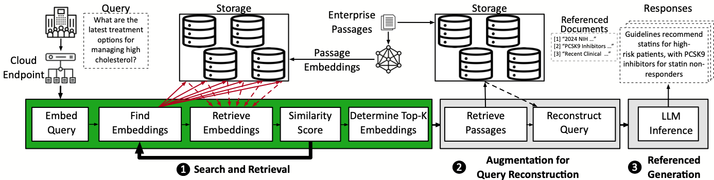

# In-Storage Acceleration of Retrieval Augmented Generation as a Service: Artifact Evaluation README

## Table of Contents
1. [Overview](#1-overview)  
2. [Setup](#2-setup)  
3. [Datasets](#3-datasets)  
4. [Benchmarks](#4-benchmarks)  
5. [Baseline](#5-baseline-cpu-dram)  
6. [Trace Files](#6-trace-files)  
7. [Simulator](#7-ragx)  

---

## 1. Overview

<p align="center">
  
  <br>
  <em>Figure 1: RAG Pipeline.</em>
</p>

The RAG pipeline shown in Figure 1 consists of four key phases:

1. **Embed Query**: Converts the input query into a vector representation (embedding).
2. **Search and Retrieval**: The query embedding is used to retrieve relevant documents from a corpus.
3. **Augmentation**: Additional retrieved context is incorporated to the query.
4. **Referenced Generation**: The final step, where the LLM generates response using the augmented context.

This artifact provides a framework to evaluate the performance of different retrieval models using real-world biomedical datasets like **PubMed** (500K passages) and **BioASQ** (queries). Since the proposed polymorphic accelerator is designed to accelerate the **query embedding** and **search/retrieval** phases, this artifact focuses exclusively on these steps. The augmentation and referenced generation phases are not included in this artifact's scope, but the entire RAG pipeline can be run on AWS following the instructions [instructions here](../benchmarks/aws/README.md). Keep in mind that to run **LLaMA**, you will need to obtain permission from Meta’s website. You can find more information [here](https://www.llama.com/llama3/license/). For the accelerator, we provide the simulator since the RTL consists of 87K lines of code with TODO files, which is beyond the permissible file limits. 

Overall it takes between 2-3 hours to complete.

---
## 2. Setup

### 2.1. Clone the Repository

Start by cloning the GitHub repository to your local machine:
```bash
git clone https://github.com/rohanmahapatra/ragx
cd ragx/artifact
```

### 2.2. Docker Setup (Recommended)

We provide a pre-configured Docker container for setting up the environment. If you choose this method, you don't need to manually install dependencies. Follow the steps below:

#### **1. Check if Docker is Installed**
Run the following command to check if Docker is installed:

```bash
which docker
```

If Docker is installed, this command will return its path (e.g., `/usr/bin/docker`). If nothing is returned, you need to install Docker.

#### **2. Install Docker (if not installed)**  
For **Ubuntu/Debian**, run:

```bash
sudo apt update
sudo apt install -y docker.io
```

For **CentOS/RHEL**, run:

```bash
sudo yum install -y docker
```

For **Mac (using Homebrew)**:

```bash
brew install --cask docker
```

For **Windows**, install **Docker Desktop** from [Docker's official website](https://www.docker.com/products/docker-desktop).

#### **3. Start and Enable Docker**
If Docker is installed but not running, start it with:

```bash
sudo systemctl start docker
sudo systemctl enable docker
```

#### **4. Add Your User to the Docker Group (Optional)**
If running `docker` requires `sudo`, add yourself to the Docker group to run it without `sudo`:

```bash
sudo usermod -aG docker $USER
newgrp docker
```

Then try:

```bash
docker --version
```

#### **5. Troubleshooting Docker Issues**
If you encounter **permission denied while trying to connect to the Docker daemon socket**, follow these steps:

1. **Ensure Docker Daemon is Running**
   ```bash
   sudo systemctl status docker
   ```
   If it's not running, start it:
   ```bash
   sudo systemctl start docker
   ```

2. **Re-add Your User to the Docker Group** (if necessary):
   ```bash
   sudo usermod -aG docker $USER
   newgrp docker
   ```
   Then log out and log back in, or restart your system.

3. **Use BuildKit Instead of the Deprecated Legacy Builder**
   ```bash
   sudo apt install docker-buildx-plugin -y
   export DOCKER_BUILDKIT=1
   ```

4. **Test Docker Permissions**
   ```bash
   docker run hello-world
   ```
   If this runs successfully, your permissions are correctly set.

5. **Check Docker Logs for Errors**
   ```bash
   journalctl -u docker --no-pager | tail -50
   ```

More details on using dockers can be found [here](DOCKER.md)
  
Once Docker is set up, proceed with the following steps to launch the docker in interactive mode:

**6. Build and Run the Docker Container in interactive mode**

1. **Build the Docker image**:
    ```bash
    ./build_docker.sh
    ```

2. **Run the Docker container**:
    - For GPU-enabled setup:
        ```bash
        ./run_docker_gpu.sh
        ```
    - For CPU-only setup:
        ```bash
        ./run_docker_cpu.sh
        ```

**Note**: If you encounter issues with GPUs not being available in the Docker container, refer to [this StackOverflow link](https://stackoverflow.com/questions/72932940/failed-to-initialize-nvml-unknown-error-in-docker-after-few-hours) to resolve the error.

### 2.3. Manual Setup (Optional)

If you choose to manually set up the environment, follow these instructions. Note that when using Docker, you do not need to install packages or set paths—just proceed to running the scripts.

1. **Create a conda environment**:
    ```bash
    conda env create -f environment.yml
    conda activate artifact
    ```
2. **Install other dependencies**:
    ```bash
    sudo apt update
    sudo apt install openjdk-17-jdk
    pip install pyserini==0.22.0
    ```

---

## 3. Datasets

For our evaluation, we used publicly available datasets: **PubMed** (biomedical passages) and **BioASQ** (biomedical queries). These datasets are essential for generating embeddings and running the benchmarks.

### Automated Docker Instructions (Recommended)
We have included a shell script to download the required datasets:

```bash
./download_datasets.sh
```
This script will first download the PubMed biomedical passage dataset, which is composed of ~50 million passages (~25GB). Next, it will extract the first 500K passages to create a smaller version of the dataset. Finally, the BioASQ dataset, consisting of 3,800 biomedical queries, will be downloaded. This process will take ~20 minutes. 

### Manual Instructions
### 3.1. Download Datasets

1. **Download PubMed and BioASQ datasets**:
    ```bash
    cd ragx/dataset
    python3 download_pubmed.py
    python3 download_bioasq.py
    ```

### 3.2. Shrink PubMed Dataset

To scale the PubMed dataset to 500K passages, follow these steps:

1. **Shrink the dataset**:
    ```bash
    python3 shrink_pubmed.py
    ```

2. **Create a directory for the 500K dataset**:
    ```bash
    mkdir pubmed_500K
    mv pubmed_corpus_500K.jsonl pubmed_500K/
    ```

The **PubMed (500K)** and **BioASQ** datasets should now be ready for benchmarking.

---

## 4. Benchmarks

We use five benchmarks in our evaluation: **BM25**, **SPLADEv2**, **ColBERT**, **Doc2Vec**, and **GTR**. Below are the instructions to generate the necessary databases for each of these benchmarks.
### Automated Docker Instructions (Recommended)
To generate the databases for BM25, ColBERT, Doc2Vec, and GTR (SPLADEv2 not included because it is not part of the functional artifact), run the following shell script:
```bash
./build_databases.sh
```
The generated databases are in the /app/benchmarks directory. For **BM25**, the database is an inverted index composed of posting lists and is constructed using Pyserini. For **ColBERT**, **Doc2Vec**, and **GTR**, the databases are HNSW-based and constructed using Meta's FAISS. 

**Note!** This process involves embedding all the passages and then constructing the corresponding databases. If you do not have GPUs available, this process can be extremely time consuming (>6 hours). We have also uploaded the databases to huggingface, so you can run the following script to download them and populate the /app/benchmarks directory:
```bash
./download_databases.sh
```
The databases will be in the respective benchmark's folder within the /app/benchmarks directory.

**Note!** This process should only take 5-10min if the download seems "stuck" it may have completed and the progress bars may just be overlapping the terminal prompt. Press enter a few times to resolve this. 

### Manual Instructions
### 4.1. BM25 Benchmark

1. **Generate the BM25 database**:
    ```bash
    cd ragx/benchmarks/BM25/
    python -m pyserini.index --collection JsonCollection --input ../../dataset/pubmed_500K --index bm25_pubmed_500K --generator DefaultLuceneDocumentGenerator --storePositions --storeDocvectors --storeRaw --storeContents
    ```

### 4.2. SPLADEv2 Benchmark

The SPLADEv2 setup is complex and requires additional setup from the [SPLADE GitHub repository](https://github.com/naver/splade). Since SPLADE is challenging to set up, we do not consider it part of the functional artifact. However, if you choose to run it, here’s the command format:

```bash
python3 -m splade.index --config.index_dir=experiments/pubmed/index500K --data.COLLECTION_PATH=/home/santhanam/rag/baseline/pubmed500K
```

### 4.3. ColBERT Benchmark
**Note!** Change the "corpus_file" path in create_hnsw_colbert.py to the path of pubmed_corpus_500K.jsonl is. This file is in the dataset/pubmed_500K/ folder. 
1. **Generate the ColBERT HNSW database**:
    ```bash
    cd ragx/benchmarks/ColBERT
    python3 create_hnsw_colbert.py
    ```

### 4.4. Doc2Vec Benchmark
**Note!** Change the "corpus_file" path in create_hnsw_doc2vec.py to the path of pubmed_corpus_500K.jsonl is. This file is in the dataset/pubmed_500K/ folder.
1. **Generate the Doc2Vec HNSW database**:
    ```bash
    cd ragx/benchmarks/Doc2Vec
    python3 create_hnsw_doc2vec.py
    ```

### 4.5. GTR Benchmark
**Note!** Change the "corpus_file" path in create_hnsw_gtr.py to the path of pubmed_corpus_500K.jsonl is. This file is in the dataset/pubmed_500K/ folder.
```bash
cd ragx/benchmarks/GTR
python3 create_hnsw_gtr.py
```
**Note!** Generating databases may take a long time depending on how many GPUs are available. To download the databases from our huggingface please use the following script (when not in a Docker container):
```bash
cd ragx/
./download_databases_manual.sh
```

---

## 5. Baseline CPU-DRAM

To recreate the **CPU-DRAM** performance results, we provide scripts to retrieve results using various benchmarks.
### Automated Docker Instructions (Recommended)
To run the CPU-DRAM baseline evaluation, run the following script:
```bash
./run_cpu_dram.sh
```
The generated results will be in /app/baseline-cpu-dram/cpu_dram_results/. The generated results consist of 4 csv files (one per retriever benchmark). Within these files, the latency for embedding and search will be recorded for 100 queries in the BioASQ dataset.

### Manual Instructions
### 5.1. BM25 Baseline

1. Navigate to the **Baseline(CPU-DRAM)** directory:
    ```bash
    cd /app/baseline-cpu-dram/
    ```

2. Open `bm25_cpu_dram_retrieve.py` and set `queries_file` to the path of the **BioASQ** dataset and `index_path` to the **BM25** index.

3. Run the retrieval process:
    ```bash
    python3 bm25_cpu_dram_retrieve.py
    ```

### 5.2. Other Baselines (SPLADEv2, ColBERT, Doc2Vec, GTR)

For each benchmark, the process is similar:

- **SPLADEv2**: Not part of the functional artifact.
- **ColBERT**: Set paths for queries and index, then run:
  Open `colbert_cpu_dram_retrieve.py` and set `queries_file` to the path of the **BioASQ** dataset and `index_path` to the **ColBERT** index (.faiss file). In addition, set model_name_custom's path to ColBERT's model found in benchmark/ColBERT/.
    ```bash
    python3 colbert_cpu_dram_retrieve.py
    ```

- **Doc2Vec**: Set paths for queries and model, then run:
   Open `doc2vec_cpu_dram_retrieve.py` and set `queries_file` to the path of the **BioASQ** dataset and `hnsw_path` to the **Doc2Vec** index (.faiss file). Set `model_path` to the path of doc2vec_model found in benchmark/Doc2Vec. Also set, `corpus_file` to the path of the pubmed_500K jsonl file. 
    ```bash
    python3 doc2vec_cpu_dram_retrieve.py
    ```

- **GTR**: Set paths for queries and index, then run:
  Open `gtr_cpu_dram_retrieve.py` and set `queries_file` to the path of the **BioASQ** dataset and `output_index_file` to the **GTR** index (.faiss file).
    ```bash
    python3 gtr_cpu_dram_retrieve.py
    ```
---

## 6. Trace Files

To generate results for **RAGX**, we instrument the search functions for both keyword-based and embedding-based retrievers to produce **trace files**. These trace files record the search process through the index and are used by the RAGX simulator. For example, with HNSW-based databases, the trace file contains the nodes visited and scored during the graph traversal. For inverted index based databases, the trace file contains the posting lists scored and the sizes of these posting lists. 

### 6.1. Trace Files Location

The trace files for the 500K dataset are located in the `/app/baseline-cpu-dram/traces` directory. These traces can be used to simulate results in the RAGX simulator.

---

## 7. RAGX Simulator  

The **RAGX simulator** processes trace files generated from the baseline execution and estimates the latency for query embedding, search, and retrieval phases. The simulator requires compiled kernel files to execute its computations.  

### 7.1. Running the Simulation

Navigate to the simulator directory:

```bash
cd ragx.simulator/
./run_ragx_simulations.sh
```


The **`run_ragx_simulations.sh`** script automates the entire process of preparing the simulator, running the simulations, and analyzing the results. Here's what the script does step-by-step:

1. **Prepares the compiled kernels**: 
   The script first navigates to the `ragx.simulator/` directory and extracts the compiled kernel files from the `compiled_kernels.zip` archive. These kernels are essential for the simulation to compute the latencies for different operations.

2. **Runs simulations for different configurations**:
   The script defines a set of configuration files (e.g., `bm25-500K.yaml`, `splade-500K.yaml`, etc.) and their corresponding trace files (e.g., `bm25_query1_500K_trace.json`, `spladev2_query1_500K_trace.json`, etc.). 
   
   - It loops over each configuration-trace pair and runs the simulation using the `eurekastore.py` script.
   - The configuration file specifies the simulator settings (e.g., model parameters, batch size), while the trace file contains the query and retrieval operations.
   - For each trace file, the script calculates the number of points or neighbors that need to be scored, invoking the simulator to estimate the compute latency for each query and retrieval operation.
   
   This process is repeated for all configurations and traces.

3. **Generates simulation logs**: 
   As the simulations run, detailed logs are saved in the `simulation_logs/` directory. These logs contain information on the simulation's progress and output.

4. **Analyzes and collates the results**: 
   After all simulations are complete, the script automatically analyzes the generated logs using the `analyze_simulated_logs.py` script. This step processes the raw simulation data and compiles it into a final results file (`ragx-results.csv`) that contains the estimated latency measurements for each configuration and trace.

### 7.2. Estimated Runtime

The simulation process will take approximately **1 hour** to complete, depending on the size of the trace files. This is due to the following steps for each simulation:

- The script accesses the trace file to identify the number of points or neighbors that need to be scored.
- It invokes the simulator to estimate the compute latency for each query and retrieval operation.
- The process is repeated for all configurations and trace files, and because trace files are typically large, this can take a significant amount of time.

### 7.3. Evaluating Alternative Configurations

To evaluate different configurations, follow these steps:

1. **Generate new execution traces**: You can create new traces for different configurations (e.g., using different models or parameters).
2. **Compile each kernel/layer**: Ensure that the necessary kernel files for the new configuration are compiled.
3. **Run the simulator**: Execute the `run_ragx_simulations.sh` script to evaluate the performance of the new configuration.

The simulator will process these new traces and configurations, providing you with latency measurements that can be compared to baseline results.


Navigate back to the artifact directory.

```bash
cd ragx.simulator/
./run_ragx_simulations.sh
```

### 7.4. Exiting Interactive Mode

Once you are finished with the Docker container, exit the interactive mode by typing:

```bash
exit
```

This will close the Docker container's shell.

### 7.5. Stopping Docker Container

To stop the running Docker container, use the following command:

```bash
docker stop <container_name>
```

Replace `<container_name>` with the actual name of your running container (e.g., `ragx-container`). You can find the container name by running:

```bash
docker ps
```

This will display the currently running containers, and you can identify the name of the container to stop.

### 7.6. Removing Docker Container (Optional)

If you wish to completely remove the Docker container after stopping it, you can run:

```bash
docker rm <container_name>
```
This will remove the stopped container from your system. This step is optional and can be skipped if you plan to reuse the container later.


### Conclusion  

This artifact offers a framework for assessing in-storage acceleration in Retrieval-Augmented Generation. By following the provided guidelines, users can systematically benchmark different retrieval models and compare them against conventional baselines. The included simulator facilitates detailed performance analysis, enabling a comprehensive evaluation of the proposed accelerator.
